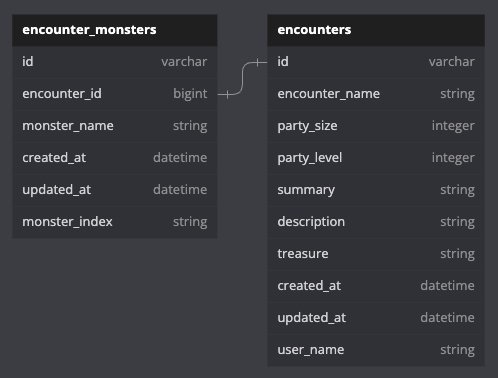

<a name="readme-top"></a>
<!-- PROJECT SHIELDS -->

[](INSERT-DEPLOY-LINK)
[![Contributors][contributors-shield]][contributors-url]
[![Forks][forks-shield]][forks-url]
[![Issues][issues-shield]][issues-url]


<!-- PROJECT LOGO -->
<br />
<div align="center">
  <a href="https://github.com/Tavern-Keeper-2308/tavern_keeper_be">
    
  </a>

<h3 align="center">Tavern Keeper</h3>

  <p align="left">
    This application is a Dungeons and Dragons Encounter Builder, with the intended user being a Dungeon Master. It allows the user to fill out a form to add encounter details including encounter name, party size, party level, summary, description, treasure & rewards, and monsters. Monsters from the D&D 5e compendium can be filtered and added based on size, name, hit points, and armor class attributes. 
    <br />
    This GraphQL API handles the backend functionality including: 
    <ul>
      <li><a href="https://www.dnd5eapi.co/docs/#overview--graphql">Consumption of third party D&D 5e GraphQL API</li>
      <li>Query endpoint(s) for display of created encounters as well as monster details</li>
      <li>Mutation endpoint(s) for creation of new encounters</li>
    </ul>
    <br />
    <a href="https://github.com/Tavern-Keeper-2308/tavern_keeper_be"><strong>Explore Backend docs »</strong></a>
    <br />
    <br />
    <a href="https://github.com/Tavern-Keeper-2308/tavern-keeper-fe">Frontend Repository</a>
    ·
    <a href="https://github.com/Tavern-Keeper-2308/tavern_keeper_be/issues">Report Bug</a>
    ·
    <a href="https://github.com/Tavern-Keeper-2308/tavern_keeper_be/issues">Request Feature</a>
  </p>
</div>


<!-- TABLE OF CONTENTS -->
## Table of Contents
  1. [About The Project](#about-the-project)
      - [Built With](#built-with)
      - [Gems](#gems)
  2. [Getting Started](#getting-started)
      - [Installation](#installation)
      - [Testing](#testing)
  3. [Database](#database)
  4. [Endpoints](#endpoints)
      - [Query User](#query-user)
      - [Query Encounter](#query-encounter)
      - [Mutation New User](#mutation-new-user)
      - [Mutation New Encounter](#mutation-new-encounter)
  5. [Roadmap](#roadmap)
  6. [Contributors](#contributors)


<!-- ABOUT THE PROJECT -->
## About The Project


[](INSERT-DEPLOY-LINK)

### Built With
* [![Ruby on Rails][Rails-shield]][Rails-url]
* [![GraphQL][GraphQL-shield]][GraphQL-url]
* [![PostgreSQL][PostgreSQL-shield]][PostgreSQL-url]
* [![HTML][HTML-shield]][HTML-url]
* [![JavaScript][JavaScript-shield]][JavaScript-url]

<p align="right">(<a href="#readme-top">back to top</a>)</p>

### Gems

#### Deployment
* [![faraday][gem-faraday]][gem-faraday-url]
* [![jsonapi-serializer][gem-jsonapi-serializer]][gem-jsonapi-serializer-url]

#### Testing
* [![debug][gem-debug]][gem-debug-url]
* [![rspec-rails][gem-rspec-rails]][gem-rspec-rails-url]
* [![simplecov][gem-simplecov]][gem-simplecov-url]
* [![factory_bot_rails][gem-factory_bot_rails]][gem-factory_bot_rails-url]
* [![faker][gem-faker]][gem-faker-url]
* [![pry][gem-pry]][gem-pry-url]
* [![shoulda-matchers][gem-shoulda-matchers]][gem-shoulda-matchers-url]
* [![capybara][gem-capybara]][gem-capybara-url]
* [![webmock][gem-webmock]][gem-webmock-url]
* [![vcr][gem-vcr]][gem-vcr-url]

<p align="right">(<a href="#readme-top">back to top</a>)</p>


<!-- GETTING STARTED -->
## Getting Started

To get a local copy up and running follow these simple example steps.

### Database 



### Installation

1. Clone the repo
   ```sh
   git clone https://github.com/Tavern-Keeper-2308/tavern_keeper_be.git
   ```
2. Gem Bundle
   ```sh
    bundle
   ```
5. Rake
   ```sh
    rails db:{drop,create,migrate,seed}
   ```

<p align="right">(<a href="#readme-top">back to top</a>)</p>

### Testing
1. Run test suite
   ```sh
   bundle exec rspec
   ```

<p align="right">(<a href="#readme-top">back to top</a>)</p>


<!-- ENDPOINTS -->
## Endpoints

### [INSERT-ENDPOINT-NAME-HERE](#INSERT-ENDPOINT-TAG_HERE)

**`ENDPOINT BADGE HERE`**
##### Example Query/Mutation (MAKE SURE TO DELETE ONE THAT IT NOT IS)
```graphql
INSERT-QUERY-HERE
```
##### Example GraphQL Variables
```graphql
INSERT-QUERY-HERE
```
##### Example Response
```json
INSERT-JSON-RESPONSE-HERE
```
#### Error Handling
##### `INSERT-ERROR-CODE-HERE` INSERT-ERROR-EXPLAINATION-HERE
##### Example Query
```graphql
INSERT-QUERY-HERE
```
##### Example Response
```json
INSERT-JSON-RESPONSE-HERE
```

<p align="right">(<a href="#readme-top">back to top</a>)</p>


### [Query User](#query-user)

**`ENDPOINT BADGE HERE`**
##### Example Query
```graphql
query getUser($id: Integer!) {
    queryUsers (byId: $id) {
        id
        username
        password
        encounters {
            encounter_id
        }
    }
}
```
##### Example GraphQL Variables
```graphql
{
    "id": 55
}
```
##### Example Response
```json
{
    "data": {
        "queryUsers": [
            {
                "'id": 55,
                "username": "Shrek",
                "password": "password123",
                "encounters": [
                    {
                        "encounter_id": 3
                    },
                    {
                        "encounter_id": 5
                    }
                ]
            }
        ]
    }
}
```
#### Error Handling
##### `INSERT-ERROR-CODE-HERE` INSERT-ERROR-EXPLAINATION-HERE
##### Example Query
```graphql
INSERT-QUERY-HERE
```
##### Example Response
```json
INSERT-JSON-RESPONSE-HERE
```

<p align="right">(<a href="#readme-top">back to top</a>)</p>


### [Query Encounter](#query-encounter)
**`ENDPOINT BADGE HERE`**
##### Example Query
```graphql
query getEncounter($id: Integer!) {
    queryEncounters (byId: $id) {
        id
        copper
        silver
        gold
        platinum
        electrum
        encounter_loots {
            item_name
        }
        encounter_monsters {
            monster_name
        }
    }
}
```
##### Example GraphQL Variables
```graphql
{
    "id": 55
}
```
##### Example Response
```json
{
    "data": {
        "queryEncounters": [
            {
                "'id": 55,
                "copper": "1",
                "silver": "1",
                "gold": "1",
                "platinum": "1",
                "electrum": "1",
                "encounter_loots": [
                    {
                        "item_name": "Longbow"
                    },
                    {
                        "item_name": "Greataxe"
                    }
                ],
                "encounter_monsters": [
                    {
                        "monster_name": "Beholder"
                    }
                ]
            }
        ]
    }
}
```
#### Error Handling
##### `INSERT-ERROR-CODE-HERE` INSERT-ERROR-EXPLAINATION-HERE
##### Example Query
```graphql
INSERT-QUERY-HERE
```
##### Example Response
```json
INSERT-JSON-RESPONSE-HERE
```

<p align="right">(<a href="#readme-top">back to top</a>)</p>


### [Mutation New User](#mutation-new-user)
**`ENDPOINT BADGE HERE`**
##### Example Mutation
```graphql
mutation {
    createUser(input: {
        username: "Shrek",
        password: "password123"
    }) {
        user {
            id
            username
        }
        errors
    }
}
```
##### Example Response
```json
{
    "data": {
        "createUser": {
            "user": {
                "id": "55",
                "username": "Shrek"
            },
            "errors": []
        }
    }
}
```
#### Error Handling
##### `INSERT-ERROR-CODE-HERE` INSERT-ERROR-EXPLAINATION-HERE
##### Example Mutation
```graphql
INSERT-QUERY-HERE
```
##### Example Response
```json
INSERT-JSON-RESPONSE-HERE
```

<p align="right">(<a href="#readme-top">back to top</a>)</p>


### [Mutation New Encounter](#mutation-new-encounter)
**`ENDPOINT BADGE HERE`**
##### Example Mutation
```graphql
mutation {
    createEncounter(input: {
        copper: 1,
        silver: 1,
        gold: 1,
        platinum: 1,
        electrum: 1,
        encounter_loots: [
            {
                item_name: "Longbow"
            },
            {
                item_name: "Greataxe"
            }
        ],
        encounter_monsters: [
            {
                monster_name: "Beholder"
            }
        ]
    }) {
        encounter {
            id
            copper
            silver
            gold
            platinum
            electrum
            encounter_loots {
                item_name
            }
            encounter_monsters {
                monster_name
            }
        }
        errors
    }
}
```
##### Example Response
```json
{
    "data": {
        "createEncounter": {
            "encounter": {
                "id": 55,
                "copper": "1",
                "silver": "1",
                "gold": "1",
                "platinum": "1",
                "electrum": "1",
                "encounter_loots": [
                    {
                        "item_name": "Longbow"
                    },
                    {
                        "item_name": "Greataxe"
                    }
                ],
                "encounter_monsters": [
                    {
                        "monster_name": "Beholder"
                    }
                ]
            },
            "errors": []
        }
    }
}
```
#### Error Handling
##### `INSERT-ERROR-CODE-HERE` INSERT-ERROR-EXPLAINATION-HERE
##### Example Query
```graphql
INSERT-QUERY-HERE
```
##### Example Response
```json
INSERT-JSON-RESPONSE-HERE
```

<p align="right">(<a href="#readme-top">back to top</a>)</p>


<!-- ROADMAP -->
## Roadmap

- [ ] Database Schema
- [ ] Set Up Mock Server on Postman (browser version)
    - [ ] JSON Contracts
- [ ] Endpoint Task
    - [ ] Sub-Tasks


See the [open issues](https://github.com/Tavern-Keeper-2308/tavern_keeper_be/issues) for a full list of proposed features (and known issues).

<p align="right">(<a href="#readme-top">back to top</a>)</p>


<!-- CONTACT -->
## Contact

Organization: Tavern Keeper - INSERT-ORG-EMGAIL-HERE

Organization Link: [https://github.com/Tavern-Keeper-2308](https://github.com/Tavern-Keeper-2308)

Project Link: [https://github.com/Tavern-Keeper-2308/tavern_keeper_be](https://github.com/Tavern-Keeper-2308/tavern_keeper_be)

<p align="right">(<a href="#readme-top">back to top</a>)</p>


## Contributors

Xander Hendry 

[![LinkedIn][linkedin-shield]][linkedin-url-zh]
[![GitHub][github-shield-zh]][github-url-zh]


Sam Tran 

[![LinkedIn][linkedin-shield]][linkedin-url-st]
[![GitHub][github-shield-st]][github-url-st]


Kevin Zolman 

[![LinkedIn][linkedin-shield]][linkedin-url-kz]
[![GitHub][github-shield-kz]][github-url-kz]


Erica Hagle 

[![LinkedIn][linkedin-shield]][linkedin-url-eh] 
[![GitHub][github-shield-eh]][github-url-eh]


Arden Ranta 

[![LinkedIn][linkedin-shield]][linkedin-url-ar] 
[![GitHub][github-shield-ar]][github-url-ar]


<!-- MARKDOWN LINKS & IMAGES -->
<!-- https://www.markdownguide.org/basic-syntax/#reference-style-links -->
[contributors-shield]: https://img.shields.io/github/contributors/Tavern-Keeper-2308/tavern_keeper_be.svg?style=for-the-badge
[contributors-url]: https://github.com/Tavern-Keeper-2308/tavern_keeper_be/graphs/contributors
[forks-shield]: https://img.shields.io/github/forks/Tavern-Keeper-2308/tavern_keeper_be.svg?style=for-the-badge
[forks-url]: https://github.com/Tavern-Keeper-2308/tavern_keeper_be/network/members
[stars-shield]: https://img.shields.io/github/stars/Tavern-Keeper-2308/tavern_keeper_be.svg?style=for-the-badge
[stars-url]: https://github.com/Tavern-Keeper-2308/tavern_keeper_be/stargazers
[issues-shield]: https://img.shields.io/github/issues/Tavern-Keeper-2308/tavern_keeper_be.svg?style=for-the-badge
[issues-url]: https://github.com/Tavern-Keeper-2308/tavern_keeper_be/issues
[license-shield]: https://img.shields.io/github/license/Tavern-Keeper-2308/tavern_keeper_be.svg?style=for-the-badge
[license-url]: https://github.com/Tavern-Keeper-2308/tavern_keeper_be/blob/master/LICENSE.txt
[product-screenshot]: images/screenshot.png

<!-- BUILD WITH SHIELDS -->
[Rails-shield]: https://img.shields.io/badge/Ruby%20on%20Rails-CC0000?style=for-the-badge&logo=ruby-on-rails&logoColor=white
[Rails-url]: https://rubyonrails.org/

[GraphQL-shield]: https://img.shields.io/badge/GraphQL-E10098?style=for-the-badge&logo=GraphQL&logoColor=white
[GraphQL-url]: https://graphql.org/

[PostgreSQL-shield]: https://img.shields.io/badge/PostgreSQL-336791?style=for-the-badge&logo=postgresql&logoColor=white
[PostgreSQL-url]: https://www.postgresql.org/

[HTML-shield]: https://img.shields.io/badge/HTML5-E34F26?style=for-the-badge&logo=html5&logoColor=white
[HTML-url]: https://developer.mozilla.org/en-US/docs/Web/HTML

[JavaScript-shield]: https://img.shields.io/badge/JavaScript-F7DF1E?style=for-the-badge&logo=javascript&logoColor=black
[JavaScript-url]: https://developer.mozilla.org/en-US/docs/Web/JavaScript

[Bootstrap.com]: https://img.shields.io/badge/Bootstrap-563D7C?style=for-the-badge&logo=bootstrap&logoColor=white
[Bootstrap-url]: https://getbootstrap.com

<!-- GEM SHIELDS -->
[gem-debug]: https://img.shields.io/badge/debug-1.9.1-brightgreen?style=flat-square
[gem-debug-url]: https://rubygems.org/gems/debug

[gem-rspec-rails]: https://img.shields.io/badge/rspec--rails-6.1.0-green?style=flat-square
[gem-rspec-rails-url]: https://github.com/rspec/rspec-rails

[gem-simplecov]: https://img.shields.io/badge/simplecov-0.22.0-yellow?style=flat-square
[gem-simplecov-url]: https://github.com/simplecov-ruby/simplecov

[gem-factory_bot_rails]: https://img.shields.io/badge/factory_bot_rails-6.4.0-success?style=flat-square
[gem-factory_bot_rails-url]: https://github.com/thoughtbot/factory_bot_rails

[gem-faker]: https://img.shields.io/badge/faker-3.2.2-red?style=flat-square
[gem-faker-url]: https://github.com/faker-ruby/faker

[gem-pry]: https://img.shields.io/badge/pry-0.14.2-yellow?style=flat-square
[gem-pry-url]: https://github.com/pry/pry

[gem-shoulda-matchers]: https://img.shields.io/badge/shoulda--matchers-6.0.0-orange?style=flat-square
[gem-shoulda-matchers-url]: https://github.com/thoughtbot/shoulda-matchers

[gem-faraday]: https://img.shields.io/badge/faraday-2.8.1-yellowgreen?style=flat-square
[gem-faraday-url]: https://github.com/lostisland/faraday

[gem-figaro]: https://img.shields.io/badge/figaro-1.2.0-critical?style=flat-square
[gem-figaro-url]: https://github.com/laserlemon/figaro

[gem-jsonapi-serializer]: https://img.shields.io/badge/jsonapi--serializer-2.2.0-blue?style=flat-square
[gem-jsonapi-serializer-url]: https://github.com/jsonapi-serializer/jsonapi-serializer

[gem-capybara]: https://img.shields.io/badge/capybara-3.39.2-brightgreen?style=flat-square
[gem-capybara-url]: https://github.com/teamcapybara/capybara

[gem-webmock]: https://img.shields.io/badge/webmock-3.19.1-yellowgreen?style=flat-square
[gem-webmock-url]: https://github.com/bblimke/webmock

[gem-vcr]: https://img.shields.io/badge/vcr-6.2.0-orange?style=flat-square
[gem-vcr-url]: https://github.com/vcr/vcr


<!-- CONTRIBUTOR SHIELDS AND URLS -->
[github-shield-zh]: https://img.shields.io/badge/GitHub-XanderHendry-success?style=for-the-badge&logo=github
[github-url-zh]: https://github.com/xanderhendry

[github-shield-st]: https://img.shields.io/badge/GitHub-Sykogst-success?style=for-the-badge&logo=github
[github-url-st]: https://github.com/Sykogst

[github-shield-kz]: https://img.shields.io/badge/GitHub-zkevkev-success?style=for-the-badge&logo=github
[github-url-kz]: https://github.com/zkevkev

[github-shield-eh]: https://img.shields.io/badge/GitHub-ericahagle-success?style=for-the-badge&logo=github
[github-url-eh]: https://github.com/ericahagle

[github-shield-ar]: https://img.shields.io/badge/GitHub-tenthwalker-success?style=for-the-badge&logo=github
[github-url-ar]: https://github.com/tenthwalker

<!-- LINKEDIN SHIELDS AND URLS-->
[linkedin-shield]: https://img.shields.io/badge/-LinkedIn-black.svg?style=for-the-badge&logo=linkedin&colorB=555
[linkedin-url-st]: https://www.linkedin.com/in/sam-t-tran
[linkedin-url-kz]: https://www.linkedin.com/in/kevin-zolman
[linkedin-url-zh]: https://www.linkedin.com/in/xander-hendry-70b804289
[linkedin-url-eh]: https://www.linkedin.com/in/ericahagle
[linkedin-url-ar]: https://www.linkedin.com/in/arden-ranta/